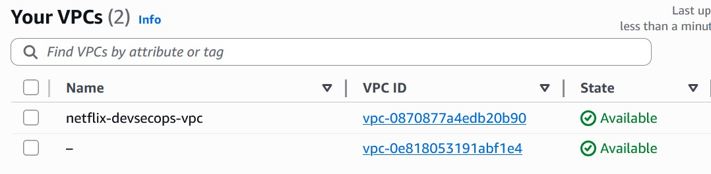
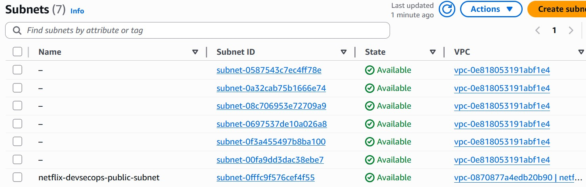
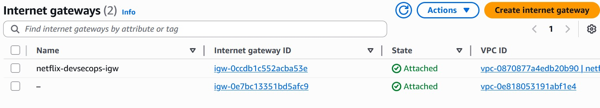
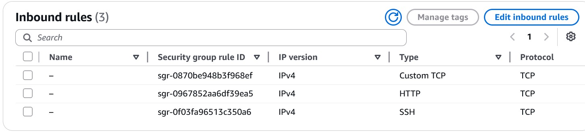
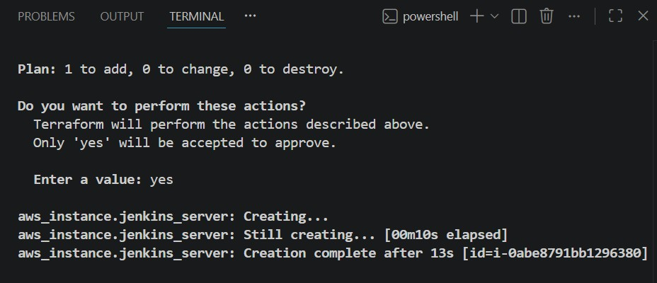
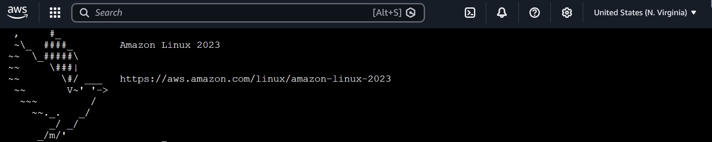
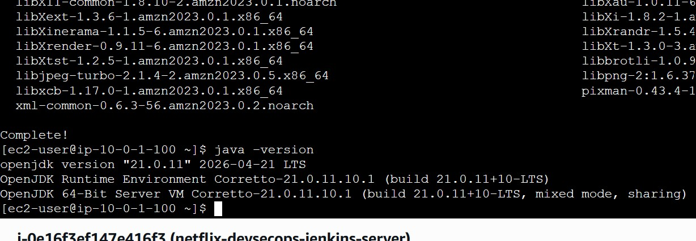

# netflix-devsecops-platform

## Overview

This project demonstrates the deployment of a Jenkins-based CI/CD pipeline on AWS using Infrastructure as Code (IaC) principles. AWS networking resources were provisioned and validated, Jenkins was deployed on an EC2 instance, and GitHub integration was configured to automate pipeline execution through a Jenkinsfile.


## Project Structure

```text
netflix-devsecops-platform/
│
├── terraform/
│   ├── main.tf
│   ├── variables.tf
│   ├── outputs.tf
│   ├── provider.tf
│   └── terraform.tfvars
│
├── jenkins/
│   └── Jenkinsfile
│
├── app/
│   └── netflix-app/
│
├── monitoring/
│   ├── prometheus.yml
│   └── grafana/
│
├── screenshots/
│   ├── terraform-apply.jpg
│   ├── state-list.jpg
│   ├── vpc.jpg
│   ├── subnet.jpg
│   ├── route-table.jpg
│   ├── gateway.jpg
│   ├── security-group.jpg
│   ├── ec2-jenkins-server.jpg
│   ├── linux-terminal.jpg
│   ├── jenkins-dashboard.jpg
│   ├── jenkins-pipeline.jpg
│   └── jenkins-console.jpg
│
├── diagrams/
│   └── architecture-diagram.png
│
├── docs/
│   ├── deployment-steps.md
│   ├── troubleshooting.md
│   └── architecture.md
│
├── README.md
├── .gitignore
└── LICENSE
```


## Build

- AWS VPC
- Public Subnet
- Internet Gateway
- Route Table
- Security Group
- EC2 Jenkins Server
- Jenkins CI/CD Pipeline
- GitHub Repository Integration


Technologies Used

Terraform
AWS VPC
Public Subnet
Internet Gateway
Route Tables
Security Groups
Amazon EC2
Amazon Linux 2023
Git
GitHub
Jenkins
Jenkinsfile
CI/CD
SSH
Infrastructure as Code (IaC)

---

## Configuration

- Configured VPC networking
- Configured route table and internet access
- Configured security group inbound rules
- Installed Jenkins on Amazon Linux
- Connected Jenkins to GitHub
- Configured Pipeline as Code using Jenkinsfile

---

## Implementation

- Provisioned infrastructure using Terraform
- Deployed Jenkins on AWS EC2
- Integrated Jenkins with GitHub SCM
- Configured Jenkins Pipeline job
- Executed automated pipeline builds

---

## Resolution

- Troubleshot Jenkins installation issues
- Validated GitHub connectivity
- Resolved pipeline configuration errors
- Investigated Jenkins executor scheduling issues
- Identified Jenkins node monitoring disk-space threshold limitations

---

## Business Case

- Automates software delivery workflows
- Reduces manual deployment effort
- Improves deployment consistency
- Supports DevOps and DevSecOps practices
- Establishes a scalable CI/CD foundation

---

## Technologies

AWS → VPC → Subnet → Route Table → Internet Gateway → Security Group → EC2 → Linux → Jenkins → GitHub → Jenkinsfile → Terraform → CI/CD Pipeline

---

# Deployment Steps

## Step 1: Provision Infrastructure

- Create VPC
- Create Public Subnet
- Create Internet Gateway
- Create Route Table
- Create Security Group
- Launch EC2 Instance
- Validate infrastructure deployment

### Commands

```bash
terraform init
terraform validate
terraform plan
terraform apply
```

---

## Step 2: Configure Jenkins Server

- Connect to EC2 instance
- Update packages
- Install Java
- Install Jenkins
- Start Jenkins service
- Enable Jenkins service

### Commands

```bash
sudo yum update -y
sudo yum install java-17-amazon-corretto -y
sudo systemctl start jenkins
sudo systemctl enable jenkins
sudo systemctl status jenkins
```

---

## Step 3: Configure Security Access

- Allow SSH (22)
- Allow HTTP (80)
- Allow Jenkins (8080)

---

## Step 4: Access Jenkins

- Navigate to:

```text
http://<EC2-Public-IP>:8080
```

- Retrieve Jenkins administrator password
- Complete initial setup
- Install recommended plugins

---

## Step 5: Connect Jenkins to GitHub

- Create GitHub repository
- Push Jenkinsfile to repository
- Configure Jenkins Pipeline Job
- Select Pipeline Script from SCM
- Configure Git repository URL

---

## Step 6: Execute Pipeline

- Trigger Build Now
- Verify GitHub checkout
- Validate Jenkinsfile retrieval
- Monitor pipeline execution

Example Console Output:

```text
Obtained Jenkinsfile from git
[Pipeline] Start of Pipeline
```

---

## Step 7: Validate Deployment

### Terraform Validation

```bash
terraform state list
```

### Jenkins Validation

- Jenkins Dashboard accessible
- GitHub repository connected
- Jenkinsfile detected
- Pipeline execution initiated

---

## Screenshots

### AWS Infrastructure











### EC2 & Linux





### Terraform Validation


### Jenkins




---

## Project Outcome

- Successfully deployed AWS infrastructure using Terraform
- Configured Jenkins on AWS EC2
- Integrated Jenkins with GitHub source control
- Implemented Pipeline as Code using Jenkinsfile
- Validated infrastructure through Terraform state management
- Demonstrated CI/CD automation and troubleshooting workflows
- Established a foundational DevSecOps pipeline architecture
